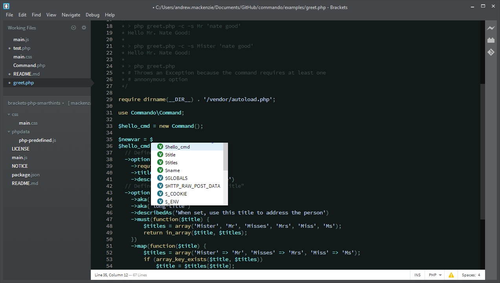
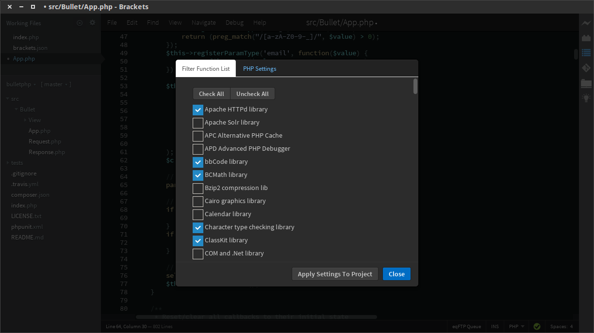

PHP-SmartHints
==============

This extension is the first project output under the [Brackets PHP SIG](http://brackets-php-sig.github.io/)
and is intended to be an intelligent coding hinting tool to make PHP developers' lives easier when 
coding PHP in the [Brackets code editor](http://brackets.io).  

The extension makes use of the core `CodeHintManager` module in Brackets.

This extension is being rolled out in phases that incrementally add useful features on the base of simple
code hints on PHP code.

* Phase 1: base release offering hinting of local variables (i.e. those declared in the current document such as `$myVar`),
predefined variables from PHP (e.g. `$_POST`), predefined constants (e.g. `__FILE__`), predefined functions (e.g. `json_encode`), and PHP keywords (e.g. `foreach`).  This release has some known issues, but is generally useful
and is the most feature complete PHP code hint extension in the [Brackets Registry](https://brackets-registry.aboutweb.com/) even in this initial release.

* Phase 2: will add further functionality to the extension.  It is planned to be able to pick up `class` hinting 
from classes in scope from an `include/require` or `use` statement.  The specific feature set has not been
determined for this release yet, but it should be the start of putting the *smart* in *SmartHints* ;)

* Phase 3: will try and work on **parameter hinting** so that you get some guidance on entering parameters 
with functions.  This functionality is not currently covered by a core Brackets module but the core dev team
has built parameter hinting in to the JS hint manager so there is some prior art to work with for this feature.

** Please note that this extension will make NO ATTEMPT to support PHP prior to version 5.3 and any issues/PRs
that are specific to versions prior to 5.3 will be closed without review **

### Filter PHP Functions by Module
As of release 1.1.0, you can add project-level filtering of which PHP modules are included in the hint list for
PHP files.  This helps reduce the size of the lists and therefore allow the suggestions to be more suited to your
specific project.

The filter can be set in one of two ways:
* using the new Project Settings Dialog UI (see below for a screenshot).  This dialog is accessed using the *lightbulb* icon on the toolbar.
* editing the `.brackets.json` file manually.  This file must be in the root of your PHP project.  The key you edit is: `"php-sig.php-smarthints.filteredFunctionList"` and it takes an array of module shortnames as modules you **do want included**.  The module short names can be found in the `phpdata/php-function-groups.json` config file.

**Note** if there is no setting in the project-level `.brackets.json` file, the default is that **all* modules are included in hinting.

####Changelog

[CHANGELOG](CHANGELOG.md)

*note* - you should also check out the execellent [PHP Code Quality Tools](https://github.com/mikaeljorhult/brackets-php-code-quality-tools) extension from [Mikael Jorhult](https://github.com/mikaeljorhult) for PHP linting and code style checking.  Mikael is also a member
of the *Brackets PHP SIG*.
